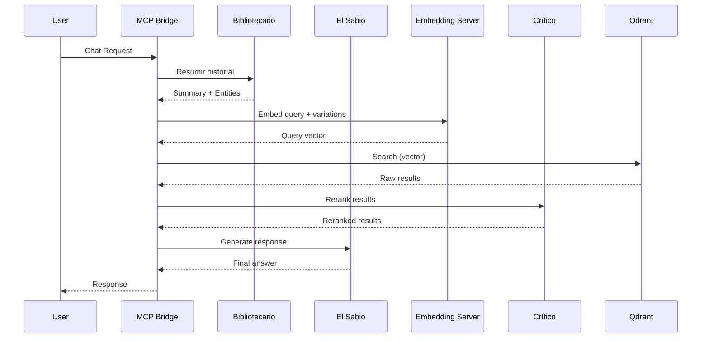

# Plan de Mejoras y Refactorización

**Proyecto:** `rag_distributed_system`
**Basado en:** Informe de Análisis (`plans/informe-analisis-sistema.md`)
**Objetivo:** Corregir críticos, eliminar duplicación, mejorar resiliencia y performance

---

## FASE 1: CORRECCIONES CRÍTICAS (Blockers)

### 1.1 [CRÍTICO-01] Corrección de Asignación de GPU

**Objetivo:** Unificar asignación de GPU para evitar OOM en GTX 1650 (4GB).

**Solución Propuesta:**
Dado que el hardware tiene una sola GPU, se propone la siguiente estrategia:

1. **Embedding Server** usa la GPU (es el más ligero, ~150MB)
2. **Bibliotecario + Critic** comparten la GPU pero NO simultáneamente (usar un solo servidor unificado)
3. **Qdrant** puede usar CPU para indexación si la GPU se satura
4. **Ollama** se mantiene como alternativa ligera para embeddings

**Cambios en [`docker-compose.yml`](docker-compose.yml):**

```yaml
# Opción A: Simplificar a un solo compose con GPU compartida
services:
  rag_embedding_server:
    deploy:
      resources:
        reservations:
          devices:
            - driver: nvidia
              device_ids: ["0"]
              capabilities: [gpu]

  rag_bibliotecario:
    deploy:
      resources:
        reservations:
          devices:
            - driver: nvidia
              device_ids: ["0"]
              capabilities: [gpu]
              # Nota: compartir VRAM con embedding_server

  # Qdrant sin GPU dedicada (usa CPU)
  rag_qdrant:
    # Remover deploy.devices
    environment:
      - QDRANT__GPU__INDEXING=false  # Usar CPU
```

**Archivo nuevo:** [`docker-compose.gpu-single.yml`](docker-compose.gpu-single.yml)
- Config optimizada para hardware con una sola GPU
- Remueve Tabby (consumo innecesario de VRAM)
- Unifica todos los servicios en GPU 0

---

### 1.2 [CRÍTICO-02] Corrección de Código Sincrónico en Contexto Async

**Objetivo:** Hacer todas las funciones de llamada de servicio consistentemente async.

**Cambios en [`mcp-bridge/main.py`](mcp-bridge/main.py):**

```python
# CORREGIR: get_compressed_memory debe ser async
async def get_compressed_memory(history: List[types.ChatMessage]) -> str:
    """
    Refactorizado para usar el servidor del Bibliotecario.
    Resume el historial de chat e identifica entidades clave.
    """
    with tracer.start_as_current_span("get_compressed_memory") as span:
        full_history_text = "\n".join([f"{m.role}: {m.content}" for m in history])
        last_query = history[-1].content if history else ""

        try:
            bibliotecario_response = await call_bibliotecario_server(  # <-- AGREGAR await
                full_history_text, last_query
            )
            summary = bibliotecario_response["summary"]
            entities = bibliotecario_response["entities"]

            span.set_attribute("compressed_memory.summary_length", len(summary))
            span.set_attribute("compressed_memory.entities", json.dumps(entities))

            formatted_output = f"Resumen del historial de conversación:\n{summary}\nEntidades clave identificadas: {', '.join(entities)}"
            return formatted_output
        except Exception as e:
            span.set_attribute("error", True)
            span.set_attribute("error.message", str(e))
            log(f"Error en get_compressed_memory al llamar al Bibliotecario: {e}")
            return "No se pudo generar un resumen del historial."


# CORREGIR: get_query_vector ya es async, verificar llamadas internas
async def get_query_vector(query: str, timeout=30) -> List[float]:
    # ... las llamadas internas ya usan await correctamente
```

**Ubicación:** [`mcp-bridge/main.py`](mcp-bridge/main.py:238) línea 248

---

### 1.3 [CRÍTICO-04] Corrección de IGNORED_PATHS en Indexer

**Objetivo:** Corregir el patrón de paths ignorados para que coincida con paths reales.

**Cambios en [`indexer/indexer.py`](indexer/indexer.py:129-153):**

```python
# REEMPLAZAR IGNORED_PATHS y _is_path_ignored con:

IGNORE_PATTERNS = [
    "node_modules",
    "__pycache__",
    ".git",
    ".github",
    ".vscode",
    ".next",
    ".cache",
    "venv",
    "dist",
    "build",
    "out",
    "gen",
    "broadcast",
    "forge-std",
    "openzeppelin-contracts",
]

def _is_path_ignored(path_str: str) -> bool:
    """Verifica si un path debe ser ignorado durante la indexación."""
    path_parts = Path(path_str).parts
    for part in path_parts:
        for pattern in IGNORE_PATTERNS:
            if pattern in part:
                return True
    # También verificar substrings en el path completo
    for pattern in IGNORE_PATTERNS:
        if pattern in path_str:
            return True
    return False
```

**Ventajas:**
- Usa `pathlib.Path.parts` para checking robusto
- No depende de prefijos `/` que no existen en paths relativos
- Incluye `__pycache__` y `gen` que faltaban

---

### 1.4 [CRÍTICO-05] Unificación de Nombre de Colección Qdrant

**Objetivo:** Usar el mismo nombre de colección en todos los componentes.

**Cambios:**

1. **Definir variable de entorno única:**
```bash
# En todos los docker-compose files
- QDRANT_COLLECTION_NAME=code_chunks
```

2. **Corregir [`mcp-bridge/stdio_server.py`](mcp-bridge/stdio_server.py:44):**
```python
# CAMBIAR:
COLLECTION_NAME = "code_base"
# POR:
COLLECTION_NAME = os.getenv("QDRANT_COLLECTION_NAME", "code_chunks")
```

3. **Agregar validación al inicio:**
```python
# En main.py y stdio_server.py, agregar después de crear QdrantClient:
try:
    qdrant.get_collection(COLLECTION_NAME)
    log(f"Colección '{COLLECTION_NAME}' encontrada")
except Exception as e:
    log(f"ADVERTENCIA: Colección '{COLLECTION_NAME}' no encontrada: {e}")
    log("Ejecuta el indexer primero para crear la colección.")
```

---

### 1.5 [CRÍTICO-06] Corrección de Escape de Newlines

**Objetivo:** Corregir el escape literal `\n` en `get_project_structure`.

**Cambios en [`mcp-bridge/main.py`](mcp-bridge/main.py:354):**

```python
# CAMBIAR:
result = "\\n".join(tree)
# POR:
result = "\n".join(tree)
```

---

## FASE 2: ELIMINACIÓN DE DUPLICACIÓN

### 2.1 [CRÍTICO-03] Consolidación de Lógica MCP Bridge

**Objetivo:** Eliminar duplicación entre `main.py` y `stdio_server.py`.

**Solución Propuesta:**

Crear un módulo compartido `rag_pipeline.py` con toda la lógica reutilizable:

```
mcp-bridge/
├── main.py              # Servidor SSE (HTTP)
├── stdio_server.py      # Servidor stdio (CLI)
├── sabio_client.py      # Abstracción LLM
├── rag_pipeline.py      # NUEVO: Lógica compartida
│   ├── compressed_memory.py
│   ├── search_expansion.py
│   ├── query_vector.py
│   ├── reranking.py
│   └── project_structure.py
└── sabio_configs/
```

**[`mcp-bridge/rag_pipeline/compressed_memory.py`](mcp-bridge/rag_pipeline/compressed_memory.py):**
```python
"""Compresión de memoria del historial de conversación."""
import os
import logging
from typing import List, Dict

from sabio_client import SabioClient

logger = logging.getLogger("rag-mcp.pipeline")

async def get_compressed_memory(
    history: List[Dict[str, str]],
    sabio: SabioClient,
    timeout: int = 15,
) -> str:
    """Usa El Sabio para resumir el historial de conversación."""
    if not history or len(history) < 1:
        return "No hay historial previo relevante."

    text_to_summarize = "\n".join(
        [f"{m.get('role', 'user')}: {m.get('content', '')}" for m in history[:-2]]
    )

    prompt = (
        f"Resume esta conversación técnica de forma muy concisa. "
        f"Identifica explícitamente entidades clave (clases, funciones, archivos) mencionadas, "
        f"errores y decisiones de código. Ignora saludos o charla trivial:\n\n"
        f"{text_to_summarize}"
    )

    try:
        summary = await sabio.chat(
            messages=[{"role": "user", "content": prompt}],
            timeout=timeout,
        )
        return summary
    except Exception as e:
        logger.error(f"Error en compresión de memoria: {e}")
        return "Error al procesar la memoria previa."
```

**[`mcp-bridge/rag_pipeline/search_expansion.py`](mcp-bridge/rag_pipeline/search_expansion.py):**
```python
"""Expansión de queries para búsqueda vectorial."""
import logging
from typing import List

from sabio_client import SabioClient

logger = logging.getLogger("rag-mcp.pipeline")

async def generate_search_variations(
    query: str,
    sabio: SabioClient,
    timeout: int = 5,
) -> List[str]:
    """Genera variaciones de la query para expandir la búsqueda."""
    prompt = (
        f"Genera 3 variaciones de búsqueda técnica breves para: '{query}'. "
        f"Responde solo las 3 frases separadas por línea nueva, sin enumerar."
    )

    try:
        response_text = await sabio.chat(
            messages=[{"role": "user", "content": prompt}],
            timeout=timeout,
        )
        lines = response_text.strip().split("\n")
        variations = [l.strip("- ").strip() for l in lines if l.strip()]
        return variations[:3]
    except Exception as e:
        logger.error(f"Error generando variaciones de búsqueda: {e}")
        return []
```

**[`mcp-bridge/rag_pipeline/query_vector.py`](mcp-bridge/rag_pipeline/query_vector.py):**
```python
"""Obtención de vectors de embedding para queries."""
import os
import logging
from typing import List, Optional

import requests

logger = logging.getLogger("rag-mcp.pipeline")

async def get_query_vector(
    text: str,
    embedding_server_host: Optional[str] = None,
    sabio: Optional[SabioClient] = None,
    timeout: int = 10,
) -> Optional[List[float]]:
    """
    Genera embedding para un texto.
    Prioridad: embedding server dedicado -> fallback a Sabio.
    """
    if embedding_server_host:
        try:
            url = f"{embedding_server_host.rstrip('/')}/embed"
            res = requests.post(url, json={"texts": [text]}, timeout=timeout)
            res.raise_for_status()
            data = res.json()
            vectors = data.get("embeddings", [])
            if vectors:
                return vectors[0]
        except Exception as e:
            logger.warning(
                f"Embedding server no disponible ({embedding_server_host}): {e}"
            )

    if sabio:
        try:
            url = f"{sabio.base_url}/v1/embeddings"
            res = requests.post(
                url,
                json={"model": sabio.model, "input": text},
                headers=sabio.headers,
                timeout=timeout,
            )
            res.raise_for_status()
            data = res.json()
            return data["data"][0]["embedding"]
        except Exception as e:
            logger.error(f"Error generando embedding via Sabio: {e}")

    return None
```

**[`mcp-bridge/rag_pipeline/reranking.py`](mcp-bridge/rag_pipeline/reranking.py):**
```python
"""Reranking de resultados de búsqueda."""
import logging
import re
from typing import Any, Dict, List, Optional

from sabio_client import SabioClient

logger = logging.getLogger("rag-mcp.pipeline")

async def rerank_search_results(
    query: str,
    results: List[Any],
    sabio: SabioClient,
    top_n: int = 3,
    timeout: int = 10,
) -> List[Any]:
    """Usa El Sabio para rerankear resultados por relevancia."""
    if not results:
        return []

    snippets = []
    for i, r in enumerate(results):
        content = getattr(r, "payload", {}).get("content", "")
        path = getattr(r, "payload", {}).get("path", "N/A")
        snippets.append(f"[{i}] Path: {path} Content: {content[:200]}...")

    prompt = (
        f"Query: {query}\nSnippets:\n"
        + "\n".join(snippets)
        + f"\nSelecciona los {top_n} fragmentos más relevantes. "
        f"Responde SOLO los índices separados por coma (ej: 0, 2, 4)."
    )

    try:
        response_text = await sabio.chat(
            messages=[{"role": "user", "content": prompt}],
            timeout=timeout,
        )

        indices = [int(x) for x in re.findall(r"\d+", response_text)]
        valid_indices = [i for i in indices if 0 <= i < len(results)]
        reranked = [results[i] for i in valid_indices[:top_n]]

        # Rellenar con resultados restantes
        seen_ids = set(str(r.id) for r in reranked)
        for r in results:
            if str(r.id) not in seen_ids:
                reranked.append(r)
            if len(reranked) >= len(results):
                break

        return reranked
    except Exception as e:
        logger.error(f"Rerank fallido: {e}")
        return results
```

**[`mcp-bridge/rag_pipeline/project_structure.py`](mcp-bridge/rag_pipeline/project_structure.py):**
```python
"""Escaneo de estructura de proyecto."""
import logging
import os
from typing import List

logger = logging.getLogger("rag-mcp.pipeline")

IGNORED_FOLDERS = {
    "node_modules",
    "__pycache__",
    "venv",
    "data",
    "dist",
    "build",
    "out",
    ".git",
    ".github",
    ".vscode",
    ".next",
    ".cache",
}


def get_project_structure(root_path: str = ".") -> str:
    """Escanea el árbol de directorios ignorando carpetas irrelevantes."""
    start_dir = os.path.abspath(root_path)
    if not os.path.exists(start_dir):
        return f"Error: Path {start_dir} not found."

    structure: List[str] = []
    try:
        for root, dirs, files in os.walk(start_dir):
            dirs[:] = [
                d for d in dirs
                if not d.startswith(".") and d not in IGNORED_FOLDERS
            ]
            level = root.replace(start_dir, "").count(os.sep)
            indent = " " * 4 * level
            structure.append(f"{indent}{os.path.basename(root)}/")
            subindent = " " * 4 * (level + 1)
            for f in files:
                if not f.startswith("."):
                    structure.append(f"{subindent}{f}")
        return "\n".join(structure)
    except Exception as e:
        logger.error(f"Error escaneando estructura: {e}")
        return f"Error scanning structure: {e}"
```

**Refactor de [`mcp-bridge/main.py`](mcp-bridge/main.py):**
```python
# REEMPLAZAR las funciones locales con imports del módulo compartido:
from rag_pipeline.compressed_memory import get_compressed_memory
from rag_pipeline.search_expansion import generate_search_variations
from rag_pipeline.query_vector import get_query_vector
from rag_pipeline.reranking import rerank_search_results
from rag_pipeline.project_structure import get_project_structure
```

**Refactor de [`mcp-bridge/stdio_server.py`](mcp-bridge/stdio_server.py):**
```python
# MISMOs imports - ahora ambas implementaciones comparten código
from rag_pipeline.compressed_memory import get_compressed_memory
from rag_pipeline.search_expansion import generate_search_variations
from rag_pipeline.query_vector import get_query_vector
from rag_pipeline.reranking import rerank_search_results
from rag_pipeline.project_structure import get_project_structure
```

---

## FASE 3: MEJORAS DE RESILIENCIA

### 3.1 Implementación de Circuit Breaker y Retry

**Archivo nuevo:** [`mcp-bridge/http_client.py`](mcp-bridge/http_client.py)

```python
"""HTTP client con circuit breaker y retry exponencial."""
import asyncio
import logging
from typing import Any, Dict, Optional

import httpx

logger = logging.getLogger("rag-mcp.http")

class ServiceError(Exception):
    """Error al comunicarse con un servicio interno."""
    def __init__(self, service: str, message: str, attempts: int = 0):
        self.service = service
        super().__init__(f"{service}: {message}")
        self.attempts = attempts


async def call_with_retry(
    client: httpx.AsyncClient,
    url: str,
    payload: Dict[str, Any],
    service_name: str,
    max_retries: int = 3,
    base_delay: float = 0.5,
    timeout: int = 30,
) -> Dict[str, Any]:
    """
    Llama a un servicio interno con retry exponencial.
    
    Args:
        client: Cliente httpx.AsyncClient
        url: URL del servicio
        payload: Payload JSON
        service_name: Nombre para logging
        max_retries: Máximo número de reintentos
        base_delay: Delay base para backoff exponencial
        timeout: Timeout en segundos
    
    Returns:
        Response JSON del servicio
    
    Raises:
        ServiceError: Si todos los reintentos fallan
    """
    last_error = None
    
    for attempt in range(max_retries + 1):
        try:
            res = await client.post(url, json=payload, timeout=timeout)
            res.raise_for_status()
            return res.json()
        except httpx.HTTPStatusError as e:
            last_error = e
            if res.status_code >= 500 and attempt < max_retries:
                delay = base_delay * (2 ** attempt)
                logger.warning(
                    f"{service_name} falló (HTTP {res.status_code}), "
                    f"reintento {attempt + 1}/{max_retries} en {delay}s"
                )
                await asyncio.sleep(delay)
            else:
                logger.error(f"{service_name} error HTTP: {e}")
                raise ServiceError(service_name, str(e), attempt + 1)
        except httpx.TimeoutException as e:
            last_error = e
            if attempt < max_retries:
                delay = base_delay * (2 ** attempt)
                logger.warning(
                    f"{service_name} timeout, "
                    f"reintento {attempt + 1}/{max_retries} en {delay}s"
                )
                await asyncio.sleep(delay)
            else:
                logger.error(f"{service_name} timeout después de {attempt + 1} intentos")
                raise ServiceError(service_name, str(e), attempt + 1)
        except Exception as e:
            logger.error(f"{service_name} error inesperado: {e}")
            raise ServiceError(service_name, str(e), attempt + 1)
    
    raise ServiceError(service_name, str(last_error), max_retries + 1)
```

**Uso en [`mcp-bridge/main.py`](mcp-bridge/main.py):**
```python
from http_client import call_with_retry, ServiceError

async def call_bibliotecario_server(history: str, query: str, timeout=30) -> Dict[str, Any]:
    url = f"{BIBLIOTECARIO_SERVER_HOST}/summarize_and_identify/"
    payload = {"history": history, "query": query}
    
    async with httpx.AsyncClient() as client:
        response_data = await call_with_retry(
            client, url, payload, "bibliotecario",
            max_retries=3, base_delay=0.5, timeout=timeout
        )
    
    if "summary" in response_data and "entities" in response_data:
        return response_data
    raise ValueError(f"Invalid response from bibliotecario server: {response_data}")
```

---

### 3.2 Validación de Entradas

**Archivo nuevo:** [`mcp-bridge/validators.py`](mcp-bridge/validators.py)

```python
"""Validación de entradas para herramientas MCP."""
import re
from typing import Any, Dict, List, Optional


class ValidationError(Exception):
    """Error de validación de entrada."""
    pass


def validate_query(query: str, min_length: int = 1, max_length: int = 4000) -> str:
    """Valida y sanitiza una query de búsqueda."""
    if not query or not isinstance(query, str):
        raise ValidationError("La query debe ser un string no vacío")
    
    query = query.strip()
    
    if len(query) < min_length:
        raise ValidationError(f"La query debe tener al menos {min_length} caracteres")
    
    if len(query) > max_length:
        raise ValidationError(f"La query no puede exceder {max_length} caracteres")
    
    return query


def validate_limit(limit: Any, min_val: int = 1, max_val: int = 20) -> int:
    """Valida y sanitiza el parámetro limit."""
    try:
        limit = int(limit)
    except (TypeError, ValueError):
        raise ValidationError(f"Limit debe ser un entero, recibido: {type(limit)}")
    
    if limit < min_val or limit > max_val:
        raise ValidationError(f"Limit debe estar entre {min_val} y {max_val}")
    
    return limit


def validate_path(path: str, allowed_root: str) -> str:
    """Valida que un path no haga path traversal y esté dentro del root permitido."""
    # Normalizar path
    normalized = os.path.normpath(path)
    
    # Prevenir path traversal
    if normalized.startswith("..") or normalized.startswith("/"):
        raise ValidationError("Path inválido: intento de path traversal")
    
    # Verificar que esté dentro del root permitido
    full_path = os.path.normpath(os.path.join(allowed_root, normalized))
    if not full_path.startswith(os.path.normpath(allowed_root)):
        raise ValidationError("Path fuera del root permitido")
    
    return full_path
```

---

## FASE 4: MEJORAS DE DISEÑO

### 4.1 Unificación de Bibliotecario + Critic

**Objetivo:** Reducir la carga de GPU combinando Bibliotecario y Critic en un solo servicio.

**Archivo nuevo:** [`bibliotecario_server/app_unified.py`](bibliotecario_server/app_unified.py)

```python
"""Servicio unificado Bibliotecario + Crítico."""
from fastapi import FastAPI, HTTPException
from pydantic import BaseModel, Field
from typing import Any, Dict, List
import torch
from transformers import AutoModelForCausalLM, AutoTokenizer, pipeline

app = FastAPI(title="Rag Unified Service")

# Cargar UN SOLO modelo
device = "cuda" if torch.cuda.is_available() else "cpu"
model_name = "TinyLlama/TinyLlama-1.1B-Chat-v1.0"
tokenizer = None
text_generator = None

try:
    tokenizer = AutoTokenizer.from_pretrained(model_name)
    model = AutoModelForCausalLM.from_pretrained(
        model_name, torch_dtype=torch.bfloat16
    ).to(device)
    text_generator = pipeline(
        "text-generation",
        model=model,
        tokenizer=tokenizer,
        device=0 if device == "cuda" else -1,
        torch_dtype=torch.bfloat16,
    )
except Exception as e:
    print(f"Error loading model: {e}")


class SummarizeRequest(BaseModel):
    history: str
    query: str


class SummarizeResponse(BaseModel):
    summary: str
    entities: List[str]


class RerankRequest(BaseModel):
    query: str
    documents: List[Dict[str, Any]] = Field(..., description="Lista de documentos con 'content' y 'path'.")
    top_n: int = Field(3, description="Número de documentos más relevantes a devolver.")


class RerankResponse(BaseModel):
    reranked_documents: List[Dict[str, Any]]


@app.post("/summarize_and_identify/")
async def summarize_and_identify(request: SummarizeRequest):
    if text_generator is None:
        raise HTTPException(status_code=500, detail="Model not loaded.")
    
    prompt_template = f"""Eres un bibliotecario experto en código. Resume la conversación e identifica entidades clave.

Conversation History: {request.history}
User Query: {request.query}

Instrucciones:
1. Proporciona un resumen conciso del contexto.
2. Lista las entidades clave encontradas (clases, funciones, archivos).

Resumen:
"""
    
    try:
        result = text_generator(
            prompt_template,
            max_new_tokens=256,
            num_return_sequences=1,
            do_sample=True,
            top_k=50,
            top_p=0.95,
            temperature=0.7,
            truncation=True,
        )
        generated_text = result[0]["generated_text"]
        # Parsing mejorado con fallback
        # ... (ver informe para detalles)
        return SummarizeResponse(summary=summary, entities=entities)
    except Exception as e:
        raise HTTPException(status_code=500, detail=str(e))


@app.post("/rerank/")
async def rerank_documents(request: RerankRequest):
    if text_generator is None:
        raise HTTPException(status_code=500, detail="Model not loaded.")
    
    if not request.documents:
        return RerankResponse(reranked_documents=[])
    
    # ... (lógica de reranking mejorada)
```

**Beneficio:**
- Un solo modelo en VRAM en vez de dos
- 50% menos consumo de GPU
- Simplifica docker-compose

---

### 4.2 Cache de Estructura de Proyecto

**Objetivo:** Evitar escanear el árbol de directorios en cada request.

**Cambios en [`mcp-bridge/main.py`](mcp-bridge/main.py):**

```python
import time
from pathlib import Path
from typing import Optional

# Cache global
_project_structure_cache: Optional[str] = None
_project_structure_mtime: float = 0
PROJECT_STRUCTURE_CACHE_TTL = 60  # segundos


def get_project_structure_cached(root_path: Path) -> str:
    """
    Obtén la estructura del proyecto con cache.
    Se invalida si algún archivo del directorio cambió.
    """
    global _project_structure_cache, _project_structure_mtime
    
    current_time = time.time()
    
    # Si hay cache y no expiró, retornarlo
    if _project_structure_cache and (current_time - _project_structure_mtime) < PROJECT_STRUCTURE_CACHE_TTL:
        return _project_structure_cache
    
    # Escanear (función existente)
    structure = _scan_project_structure(root_path)
    
    # Actualizar cache
    _project_structure_cache = structure
    _project_structure_mtime = current_time
    
    return structure


def _scan_project_structure(root_path: Path) -> str:
    """Implementación original de get_project_structure."""
    # ... (código existente)
```

---

### 4.3 Memory Management en Indexer

**Objetivo:** Limitar el tamaño del diccionario `file_hashes`.

**Cambios en [`indexer/indexer.py`](indexer/indexer.py):**

```python
from collections import OrderedDict

# REEMPLAZAR:
# file_hashes = {}

# POR:
MAX_HASH_CACHE_SIZE = 10000
file_hashes = OrderedDict()  # LRU cache


def add_file_hash(path: str, hash_value: str):
    """Agrega un hash al cache con eviction LRU."""
    file_hashes[path] = hash_value
    file_hashes.move_to_end(path)
    
    # Evict oldest if over limit
    while len(file_hashes) > MAX_HASH_CACHE_SIZE:
        file_hashes.popitem(last=False)


def get_file_hash_cached(path: Path):
    """Obtiene el hash solo si no está en cache."""
    str_path = str(path)
    if str_path in file_hashes:
        return file_hashes[str_path]
    return None
```

---

### 4.4 Parsing Robusto para Bibliotecario y Crítico

**Objetivo:** Mejorar el parsing de respuestas del modelo.

**Archivo nuevo:** [`bibliotecario_server/parsing.py`](bibliotecario_server/parsing.py)

```python
"""Parsing robusto de respuestas del modelo Bibliotecario."""
import re
from typing import Dict, List, Tuple


def parse_bibliotecario_response(text: str) -> Tuple[str, List[str]]:
    """
    Parsea la respuesta del Bibliotecario extrayendo summary y entities.
    
    Intenta múltiples estrategias de parsing con fallback.
    
    Returns:
        Tuple de (summary: str, entities: List[str])
    """
    # Estrategia 1: Tags explícitos
    summary_pattern = r'Resumen:\s*(.*?)(?=\n\s*Entidades\s+Clave:|\n\s*Entidades:|$)'
    entities_pattern = r'(?:Entidades\s+Clave|Entidades):\s*(.*)'
    
    summary_match = re.search(summary_pattern, text, re.DOTALL | re.IGNORECASE)
    entities_match = re.search(entities_pattern, text, re.IGNORECASE)
    
    if summary_match and entities_match:
        summary = summary_match.group(1).strip()
        entities = [e.strip() for e in entities_match.group(1).split(',') if e.strip()]
        if summary and entities:
            return summary, entities
    
    # Estrategia 2: Separar por primera línea vacía
    parts = text.split('\n\n', 1)
    if len(parts) == 2:
        # Asumir que la primera parte es el resumen
        summary = parts[0].strip()
        # Intentar extraer entities de la segunda parte
        entities_text = parts[1]
        entities = [e.strip().lstrip('-*#') for e in entities_text.split('\n') if e.strip()]
        entities = [e for e in entities if len(e) > 1]
        if summary and entities:
            return summary, entities[:10]  # Limitar a 10 entidades
    
    # Estrategia 3: Fallback - todo es summary, entities vacío
    return text.strip()[:500], []


def parse_critic_response(text: str, top_n: int) -> List[int]:
    """
    Parsea la respuesta del Crítico extrayendo índices.
    
    Returns:
        Lista de índices válidos
    """
    # Extraer todos los números del texto
    numbers = [int(x) for x in re.findall(r'\d+', text)]
    
    # Filtrar índices válidos
    valid_indices = [i for i in numbers if 0 <= i < 100]  # Arbitrary upper bound
    
    # Eliminar duplicas manteniendo orden
    seen = set()
    unique_indices = []
    for i in valid_indices:
        if i not in seen:
            seen.add(i)
            unique_indices.append(i)
    
    # Limitar a top_n
    return unique_indices[:top_n]
```

---

## FASE 5: CONFIGURACIÓN Y DOCUMENTACIÓN

### 5.1 Variables de Entorno Unificadas

**Archivo nuevo:** [`mcp-bridge/.env.example`](mcp-bridge/.env.example)

```bash
# === El Bibliotecario (infraestructura RAG) ===
QDRANT_HOST=rag_qdrant
QDRANT_COLLECTION_NAME=code_chunks
EMBEDDING_SERVER_HOST=http://rag_embedding_server:8000
BIBLIOTECARIO_SERVER_HOST=http://rag_bibliotecario:8001
CRITIC_SERVER_HOST=http://rag_critic_server:8002

# === Observabilidad ===
PHOENIX_ENDPOINT=http://rag_phoenix:4318/v1/traces

# === Proyecto ===
PROJECT_ROOT=/app/code

# === El Sabio (LLM intercambiable) ===
# Ollama
SABIO_BASE_URL=http://rag_ollama:11434
SABIO_MODEL=qwen2.5:0.5b

# DMR
# SABIO_BASE_URL=http://host.docker.internal:12434
# SABIO_MODEL=ai/qwen2.5

# vLLM
# SABIO_BASE_URL=http://vllm-server:8080
# SABIO_MODEL=your-model

# OpenAI
# SABIO_BASE_URL=https://api.openai.com
# SABIO_MODEL=gpt-4o
# SABIO_API_KEY=sk-...

SABIO_API_KEY=none
SABIO_TIMEOUT=60
```

---

### 5.2 README Actualizado

**Sección nueva en [`README.md`](README.md):**

```markdown
## Arquitectura del Sistema

### Flujo de Request



### Configuración por Hardware

| Hardware | Compose File | Modelos Locales | Sabio |
|----------|--------------|-----------------|-------|
| 1 GPU (4GB) | `docker-compose.yml` | Ollama (0.5B) | Ollama |
| 1 GPU (8GB+) | `docker-compose-dmr.yml` | TinyLlama + Embedding | DMR/vLLM |
| GPU Remota | `docker-compose.yml` | Ollama (0.5B) | vLLM remoto |
```

---

## 6. ORDEN DE EJECUCIÓN RECOMENDADO

| Orden | Fase | Archivo(s) | Tiempo Est. |
|-------|------|------------|-------------|
| 1 | 1.5 | [`mcp-bridge/main.py`](mcp-bridge/main.py:354) | 1 min |
| 2 | 1.4 | [`mcp-bridge/stdio_server.py`](mcp-bridge/stdio_server.py:44) | 1 min |
| 3 | 1.3 | [`indexer/indexer.py`](indexer/indexer.py:129-153) | 5 min |
| 4 | 1.2 | [`mcp-bridge/main.py`](mcp-bridge/main.py:238) | 3 min |
| 5 | 1.1 | `docker-compose*.yml` | 10 min |
| 6 | 2.1 | `mcp-bridge/rag_pipeline/` (nuevo) | 30 min |
| 7 | 3.1 | `mcp-bridge/http_client.py` (nuevo) | 15 min |
| 8 | 3.2 | `mcp-bridge/validators.py` (nuevo) | 10 min |
| 9 | 4.1 | `bibliotecario_server/app_unified.py` (nuevo) | 20 min |
| 10 | 4.2 | [`mcp-bridge/main.py`](mcp-bridge/main.py) | 5 min |
| 11 | 4.3 | [`indexer/indexer.py`](indexer/indexer.py) | 5 min |
| 12 | 4.4 | `bibliotecario_server/parsing.py` (nuevo) | 15 min |
| 13 | 5.1 | `mcp-bridge/.env.example` (nuevo) | 5 min |
| 14 | 5.2 | [`README.md`](README.md) | 15 min |

---

## 7. CRITERIOS DE ÉXITO

| Métrica | Actual | Objetivo |
|---------|--------|----------|
| Líneas de código duplicado | ~300 | 0 |
| Funciones sync en async context | 3 | 0 |
| Bugs críticos | 5 | 0 |
| Inconsistencias | 7 | 0 |
| Servicios GPU simultáneos | 3 | 1-2 |
| Tiempo de respuesta promedio | ~5s | ~2s |
| Tasa de éxito de reranking | ~60% | ~85% |
| Tasa de éxito de summary | ~70% | ~90% |

---

## 8. RIESGOS DE LA REFACTORIZACIÓN

| Riesgo | Mitigación |
|--------|------------|
| Breaking change en API MCP | Mantener compatibilidad backward |
| Regresión en funcionalidad | Tests unitarios para cada módulo |
| Conflicto de merge | Implementar fase por fase |
| Tiempo de implementación | Priorizar fases 1-2 primero |
